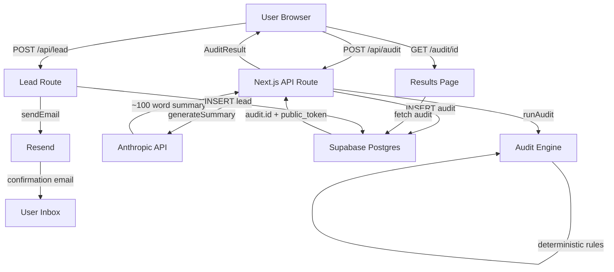

# Architecture — SpendWise AI

## System Diagram

## Data Flow

1. **User fills form** → Zustand store (persisted to localStorage)
2. **User clicks "Run My Audit"** → POST /api/audit
3. **API validates input** with Zod
4. **runAudit()** applies 6 deterministic rules → recommendations
5. **generateSummary()** calls Anthropic API → ~100 word paragraph
6. **Result saved** to Supabase audits table
7. **API returns** `{ id, publicToken }`
8. **Browser redirects** to `/audit/[id]`
9. **Results page** server-fetches audit from Supabase
10. **User shares** via publicToken URL (PII stripped)
11. **User enters email** → POST /api/lead
12. **Lead saved** to Supabase, confirmation email sent via Resend

## Why This Stack

- **Next.js 14**: Server components for SEO on results page, API routes co-located, Vercel deployment is trivial.
- **TypeScript strict**: Catches pricing calculation errors at compile time — important when dealing with money.
- **Supabase**: Postgres + RLS + free tier, no separate backend needed.
- **Zustand**: Lightweight state with persistence middleware, no boilerplate vs Redux.
- **Tailwind + shadcn**: Rapid UI with accessible primitives, consistent design tokens.

## Scaling to 10,000 Audits/Day

1. **Rate limiting**: Replace in-memory Map with Upstash Redis (1 line change).
2. **AI summary**: Add a queue (Inngest/Trigger.dev) so summary generates async, not blocking response.
3. **Database**: Add read replicas on Supabase, index on `created_at` for dashboard queries.
4. **Edge caching**: Cache public audit pages at CDN level (Vercel Edge Config) — they're immutable after creation.
5. **Email**: Move to Resend batch API for bulk sends.
